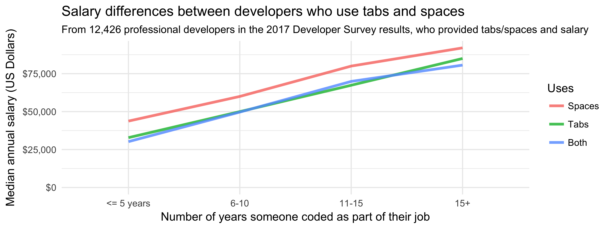
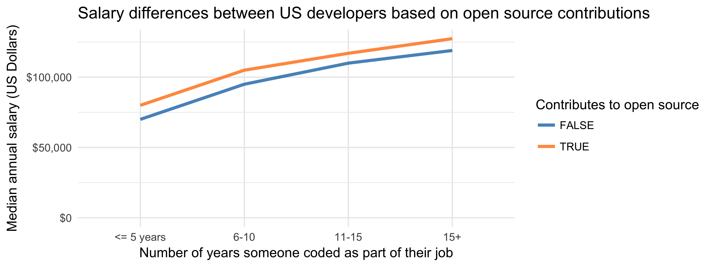
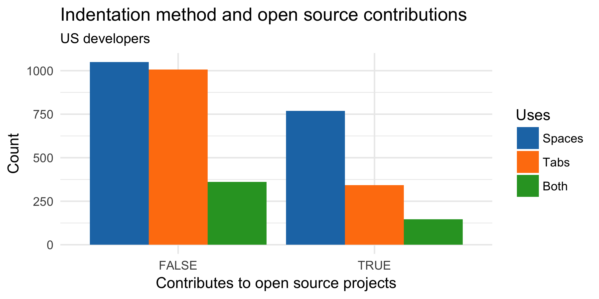
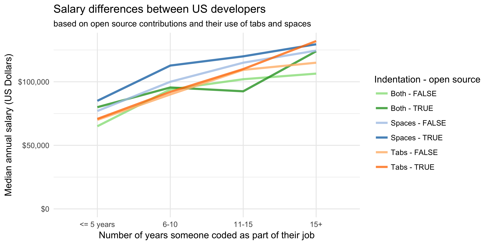
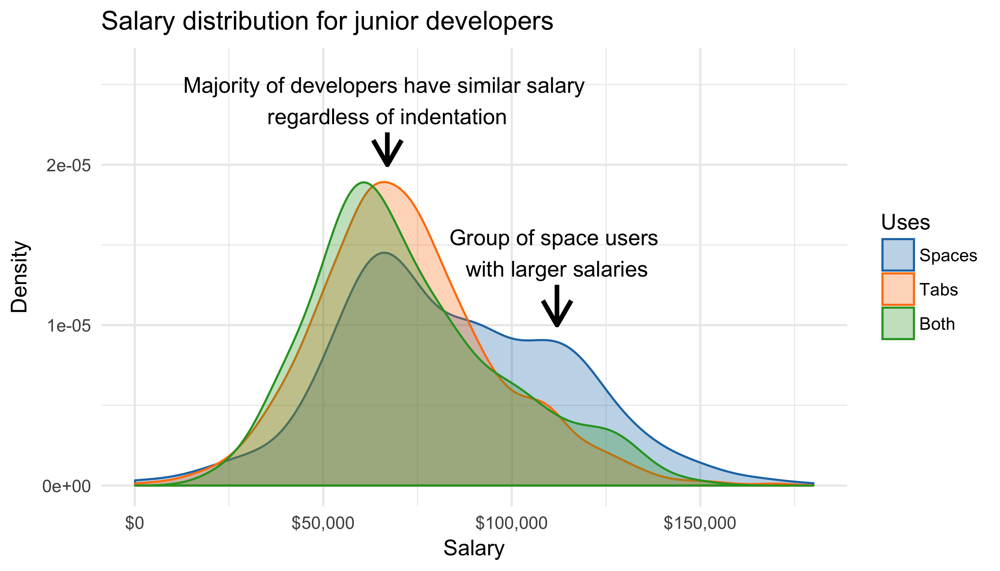
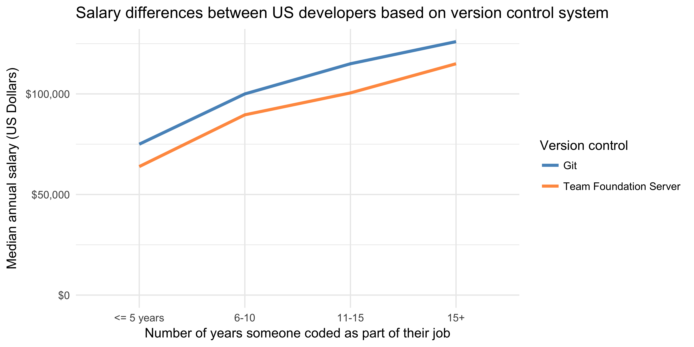
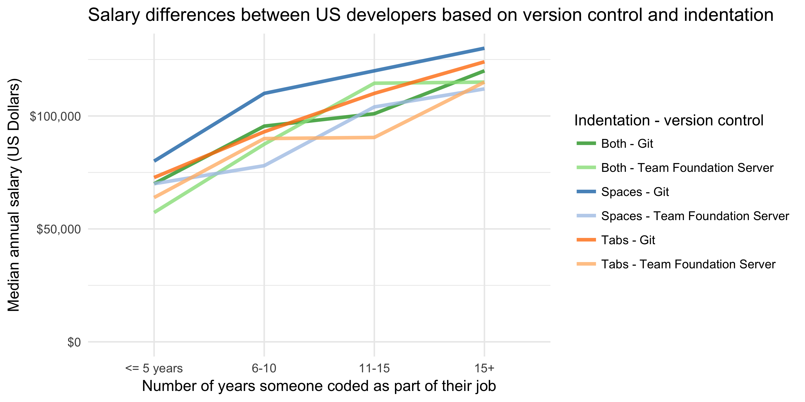
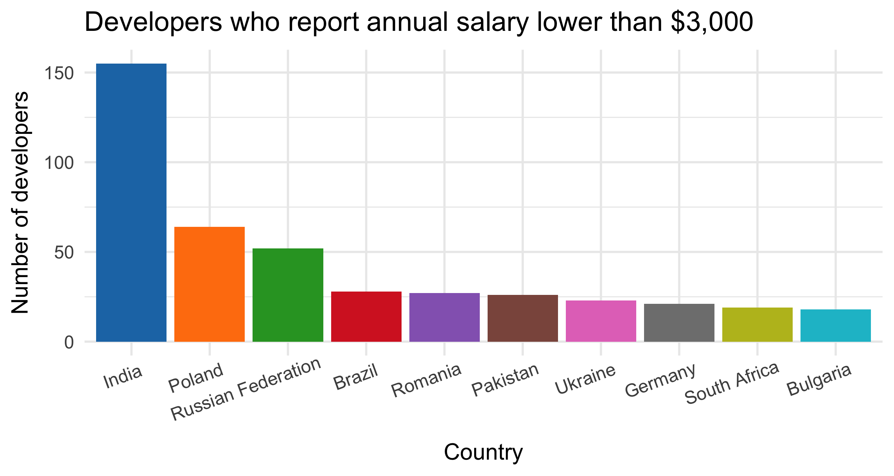
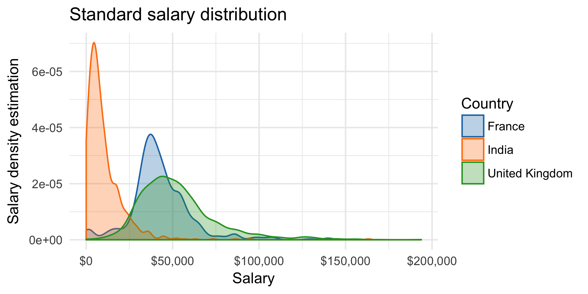

*This is the source code behind my [blog post](http://evelinag.com/blog/2017/06-20-stackoverflow-tabs-spaces-and-salary/index.html). 
The data come from [here](https://github.com/dgrtwo/tabs-spaces-post).*

A couple of days ago, David Robinson published an article on the Stack Overflow blog with a very provocative title: [Developers Who Use Spaces Make More Money Than Those Who Use Tabs](https://stackoverflow.blog/2017/06/15/developers-use-spaces-make-money-use-tabs/). It uses the data from Stack Overflow developer survey to show that indeed, using spaces is associated with higher salaries, even when we account for experience level. So, should you start using spaces instead of tabs to increase your salary? The answer is clearly *No* because correlation doesn't imply causation and intuitively the indentation of source code doesn't have any direct causal link to anyone's salary. The whole story left a lot of people scratching their heads and it even made it into a [BBC news story](http://www.bbc.co.uk/news/technology-40302410). 

I believe that data science should be about answering questions and providing new insights into data - and unfortunately the original article doesn't offer many answers. It's a fun correlation but what's behind it? This blog post is my attempt to shed some light into the issue. The original article encouraged people to explore the data for themselves and this is precisely what I did. So I'd like to invite you to follow me through a little data science detective story and a deep dive into the data from the StackOverflow survey. You'll see that tabs and spaces are not what they seem. Spoiler: your salary has more to do with the type of company and the environment you work in rather than what type of indentation you use. 


## The original findings

In the [original blog post](https://stackoverflow.blog/2017/06/15/developers-use-spaces-make-money-use-tabs/), David shows that using spaces instead of tabs is associated with higher salary and this effect seems to hold regardless of the experience level. Also, people who mix both tabs and spaces have similar salaries to people who prefer just tabs. 




Intresting, right? Also, the effect doesn't seem to be related to programming language or the type of developer you are. And same goes for the size of company you're employed in. So why do better paid developers prefer spaces? It's clear that there must be some confounding variable but I wasn't sure if it was present in the survey. I started my investigation by looking at a linear regression model from the original blog post.

## Exploring the data with linear regression

The original post included a linear regression model that predicts salary based on several variables:

* Country
* Years of programming experience
* Tabs and spaces usage
* Developer type and language 
* Level of formal education (e.g. bachelor’s, master’s, doctorate)
* Whether they contribute to open source
* Whether they program as a hobby
* Company size


I decided to have a closer look at the results and play with some modified models. For my linear regression, I concentrated on developers located in the United States. Partly because it is the largest group of developers in the survey and looking at one country removes much of regional variation, but also because I had my doubts about the salaries reported in some of the other countries (but more on that [later](#salaries_eastern_europe)). Now please bear with me, we're about to get statistical (but you can always skip directly to the plots and results below). I want to show you the line of reasoning that I followed that lead me to some of the insights.


### Diving deeper into linear regression

I'd like to note that I changed the regression model used by David in his original post because it excluded the bias term (intercept), which lead to an ANOVA-type model. I used a standard linear regression including the intercept. What I did is that I fitted two regression models:

* **Full model** with the information on tabs and spaces included 
* **Reduced model** without the information on tabs and spaces

Comparing these two models should tell me how much information can I get by including the preferred indentation method. Both models predict salary similarly well, or similarly badly, based on how you're inclined to look at it. How do we know that? We can look at the [*coefficient of determination* $R^2$](https://en.wikipedia.org/wiki/Coefficient_of_determination) which says how much variance in salary can we explain by using the input variables (years of experience, programming language, etc.). The higher this coefficient is, the better we are able to model salary as a combination of the other factors.

| Model  | Coefficient of determination $R^2$ | Adjusted $R^2_{adj}$ |
|---|---|---|
| Full model  | 0.4008  | 0.3892 |
| Reduced model  | 0.3938  | 0.3892 |

Both linear models have very similar performance, they both can explain about 40% of variance in salary. The full model has higher $R^2$ which is expected in a model with more variables. The adjusted $R^2_{adj}$ value can be used to compare the two models to see which one provides a better fit. The full model has higher $R^2_{adj}$ but the difference is only 0.0068. It seems that the the knowledge about tabs and spaces usage, although significant, doesn't contribute that much extra information. The reduced linear regression model can partly compensate for the missing information by using the other variables in the model.


I checked for collinearity which is always a danger in predictive models. Collinearity is a situation where some of the variables are highly correlated which makes it more difficult to extract their individual effects. Interestingly, there were no sign of this happening, and the regression coefficients didn't change massively between the two models. 

So did anything change between the full and reduced model? I decided to have a look at p-values of regression coefficients that represent the significance of each variable in the model. Did significance of any parameters increase significantly? I looked at the variables where their p-values dropped by at least an order of magnitude (10-fold) to see which variables became more important in the reduced model compared to the full model. 


The variables that gained more significance in the reduced model were:

* Years of programming experience
* Contributing to open source
* PHP

The coefficients for these variables also changed, but not dramatically. Together, it means that that if we remove the information about tabs and spaces from the model, the model compensates by boosting experience and open source contributions (and also if you work with PHP). Experience is an obvious factor that affects the salary, so this is not surprising. My first candidate for further investigation was open source.

I looked into open source contributions in more detail and the interesting insight is that contributing to open source is related to higher salary, at least if you live in the US. Possibly people with higher salaries are more likely to contribute to open source? The effect also holds across all experience levels. 



### Open source contributors use spaces more than tabs


How does open source relate to our original tabs versus spaces debate? Turns out that people who contribute to open source use spaces much more than people who don't. There is a roughly similar number of people who use tabs and who use spaces among those that don't contribute to open source. But when we look at people who do contribute to open source, they are more than twice as likely to use spaces rather than tabs. This difference is also statistically significant with p-value 9.1981718 &times; 10<sup>-24</sup>. The same trend holds internationally as well, although there are slightly more people using tabs in open source there.




I think we're getting closer to potential causal explanations here. The main advantage of using tabs is that you can set how they are displayed in the IDE, with spaces the layout is fixed. This means that the same code can look very different for different people if using tabs. And when people start mixing the two, one person using tabs and other using spaces within the same file, it leads to a mess. My theory is that when diverse people are working on open source projects together without enforced coding style, the possible formatting mess is nudging people towards using spaces simply because the code is consistent for everyone. 

This is just one of possible theories, I didn't look to see if possibly language communities that use predominantly spaces (like Python or Ruby) are more active in open source. Again, correlation doesn't imply causation.

### Tabs, spaces, open source & salary: how does it fit together?

Now the question is, does open source work account for higher salaries of people who use spaces more than tabs? When we plot the salaries based on open source contributions and indentation method, we get a more complex picture compared to the original that compared only tabs and spaces.



Junior developers using both tabs and spaces contributing to open source have a slightly higher median salary than people using spaces but not contributing. And open source contributors that have more than 15 years of experience and use tabs have higher median salary than people who use spaces.
Additionally, if you have less than 15 years of professional experience and use tabs, contributing to open source is not related to higher salaries. But if you use spaces, you're better paid if you also contribute to open source than if you don't. Take these results with a grain of salt because counts in some of the groups are getting relatively small.

Overall, there is some effect but it still doesn't change the global picture: people who use spaces have generally higher salaries than people who use tabs. So is there something else at play as well?

### Exploring salary distributions

At this point I was convinced that any variables affecting the salaries of tabs and spaces users were not in the simple regression model. I didn't want to go on a wild goose chase and start adding all the available variables (more than 150 of them, and all of them categorical). I decided to have a look at salary distributions for the different indentation methods: do space users have generally higher salaries than tab users, or is there a subgroup of space users who skew the results?

I plotted the distributions for the different experience levels. The graph below shows the salary densities for developers with less than five years of experience, where the effect was the clearest. All three distributions have their main mode (peak) around the same salary value between 65,000 and 70,000 USD. This peak represents the most of junior developers, and it seems that using tabs or spaces doesn't make any difference in salary there.


What is interesting is that the salary distribution for space users is actually bimodal (has two peaks). Most people have similar salary to other developers but there is a subgroup of people who use predominantly spaces and are paid much more than the rest. How does this group of people differ from the rest? I looked at what makes them different across the questions in the survey and I used the $\chi^2$ test to see if the numbers of people in different categories were significantly different for tab and space users.

### The importance of version control

Because the number of programmers in the higher salary category was not very large, I ended up with a lot of potential candidates. One of the variables that jumped up as significantly different between the higher paid group and the rest surprised me: **version control**. I filtered out only the version control systems that were used frequently among junior developers in the US (at least 20 users in the survey):


|                        | Higher salary| Lower salary|
|:-----------------------|-------------:|------------:|
|Git                     |           168|          660|
|I use some other system |            17|           30|
|Subversion              |             4|           47|
|Team Foundation Server  |             6|           92|


Surprisingly, it turns out that the version control system usage is not independent of the indentation method across all developers worldwide, not just the junior US ones (with p-value 1.5336476 &times; 10<sup>-44</sup>)! This means we have quite a strong link between tabs, spaces and version control systems.

Let's have a closer look. Among all US developers, the two most common version control systems (with at least 200 users in the dataset) are Git and Team Foundation Server (TFS). What is their effect on developers' salaries? 



People who use Git have higher salaries across all experience levels. Interesting insight, which might be also connected to our previous investigation into open source contributors. But most importantly, how does version control relate to tabs and spaces usage together with salary?



Interestingly, version control system breaks the pattern of higher salaries being always associated with space users. 
Companies using Git have mostly higher salaries regardless of indentation method, at least for developers with up to 10 years of experience! People using tabs with Git have larger salary than people using spaces with TFS, across all experience levels. Within the Git using group, people using spaces still have higher salaries than people using tabs. But within the TFS group, the pattern is not that clear: people using spaces with TFS have the lowest salaries for some of the groups. 

Internationally, the picture is partly different but it seems that you probably don't want to be a programmer with 15+ years of experience and use spaces with TFS. 


For completeness, I looked also at Subversion which was slightly more common than TFS internationally. Subversion doesn't again follow the same pattern of space users having overall larger salaries than tab users. Git + tab users have very similar salaries to Subversion + space users and Git + both tab and space users. 


## Summary #1: Why is version control so important?

To sum it up, the combination of open source contributions and version control system usage accounts for at least some of the difference in salaries between tab and spaces users. This doesn't mean that you should start using Git and contribute to open source to get paid more (although it would be great if you did that anyway!). 

I believe these two factors together point more towards different environments and different types of companies, how traditional they are and how they use modern technologies. More traditional *old-school* companies that don't use Git and open source code seem to have lower salaries in general. The type of environment is hard to measure directly in a survey and both of these factors only point in this direction. 

This is definitely not the whole story and I'm sure there are other variables that shed some light into the tabs-spaces salary inequality. My conclusions are also based mainly on US developers where the effect is the clearest. Why I had issues with the salaries in some other countries is what I discsuss below.

## <a name="salaries_eastern_europe">Why look only at US developers' salaries?</a>

Over the whole analysis I concentrated mainly on US developers and their salaries. The reason is that when I was looking at distributions of salaries with respect to various other factors, one thing caught my attention because it didn't make much sense to me. The data I was working with contained only professional developers working full time, yet there was quite a large group of people who had very low annual salaries, below 3,000 USD. That by itself unfortunately wouldn't be strange because there is a lot of inequality worldwide. What was weird were the countries where people were reporting such low salaries.



The country with the largest number of not-so-well paid developers is India which makes sense in this context, the average salary in India is significantly lower than in OECD countries. But have a look the countries after India: Poland, Russia and even Germany may not have gigantic salaries but less than 3,000 USD for a full time developer is extremely low. 

I come from the Czech republic so I have some "domain knowledge" of the region - I had a suspicion what's happening in the data. So I checked the salary distribution of a couple of countries in Central and Eastern Europe and how do their distributions compare to countries in other parts of the world.




Countries such as the UK and France and even India all have salary distributions with a single peak. On the other hand, all the Central and Eastern European countries have bimodal salary distributions (with two peaks). The first peak corresponds to the very low salary, and the second corresponds to a larger, more believable annual salary. It's less pronounced in Germany, more in Poland and much more in Russia. I checked a couple of other countries including Czech Republic and Ukraine and the trend holds across all of them. All countries from this region seem to have bimodal salary distribution. What's happening there? 

Based on my experience, the Czechs always discuss salary not in terms of the annual salary but in terms of the monthly salary. I have never ever heard any Czech person referring to their annual salary. I checked with a Polish friend and he told me the exact same story - nobody ever talks about annual salary, only about the monthly salary. Considering this, it seems likely that many people simply didn't read the survey question properly and reported their monthly salary instead, simply because that's the number they are used to think about.

Can we fix the data somehow? We can for example fit a mixture model to the data and multiply the low-salary group by 12 to get annual salary. This will create a salary distribution that is left-truncated but represents the actual salaries in the country better than the original distribution. Below is an example for Poland.


```
## fitting ...
## 
  |                                                                       
  |                                                                 |   0%
  |                                                                       
  |===                                                              |   5%
  |                                                                       
  |=======                                                          |  11%
  |                                                                       
  |==========                                                       |  16%
  |                                                                       
  |==============                                                   |  21%
  |                                                                       
  |=================                                                |  26%
  |                                                                       
  |=====================                                            |  32%
  |                                                                       
  |========================                                         |  37%
  |                                                                       
  |===========================                                      |  42%
  |                                                                       
  |===============================                                  |  47%
  |                                                                       
  |==================================                               |  53%
  |                                                                       
  |======================================                           |  58%
  |                                                                       
  |=========================================                        |  63%
  |                                                                       
  |============================================                     |  68%
  |                                                                       
  |================================================                 |  74%
  |                                                                       
  |===================================================              |  79%
  |                                                                       
  |=======================================================          |  84%
  |                                                                       
  |==========================================================       |  89%
  |                                                                       
  |==============================================================   |  95%
  |                                                                       
  |=================================================================| 100%
```


## Summary #2: Data traps

The main conclusion from the salary issue is that we always have to be careful about our data. There are many hidden biases in any survey and some of them are quite unexpected. If I wasn't aware of how people talk about their monthly salaries, I would have probably assumed that the countries have a lot of badly paid internship-style positions and that's what is skewing the data. I'm not sure which other countries discuss their salary not in terms of the annual salary, and for this reason I used mainly the US data in my analysis. Hopefully the data are the most consistent. 

Unfortunately people don't always fill in surveys correctly and it is very hard to discover this. It might have affected the tabs versus spaces question as well. Based on some reactions on social media, it seems that some people filled-in that they use tabs because they press the Tab key, even though the tabs are implicitly converted to spaces by their editors. 

## Summary #3

To sum it all up, I'm quite convinced that the difference in salaries of tab and space users is mainly due to the type of company and the environment they work in. Environments where people use Git and contribute to open source are more associated both with higher salaries and spaces, rather than with tabs. I'm sure there are other factors as well - let me know what you think! But beware: you can never trust the data completely.

Finally, I'd like to thank David for providing [the code he used in his blog post](https://github.com/dgrtwo/tabs-spaces-post) and Stack Overflow for publishing the data from their developer survey. You can get my code [from my GitHub](https://github.com/evelinag/stackoverflow-survey-analysis).
